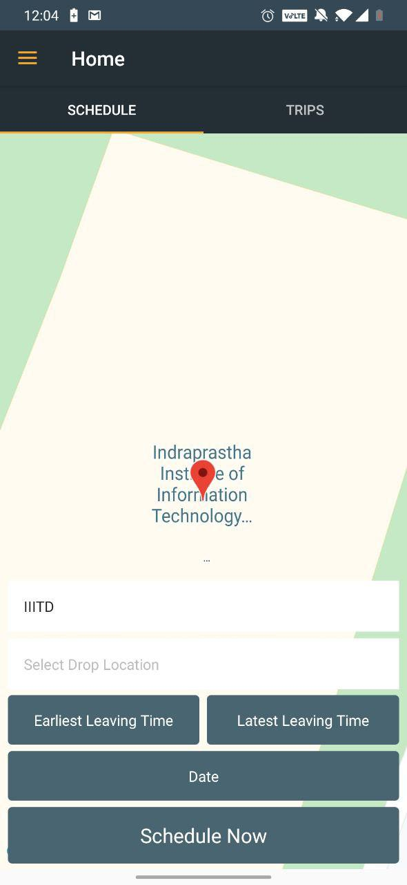

# SemiGo
App that connects cab users travelling in the same direction. Designed using various UI/UX methods.

Everyday, students in colleges and universities take cabs to go home.
Yet everyday they have to balance between comfort and money, whether to give expensive fares and travel comfortably, 
or travel with creepy strangers when pooling.
Almost every student wants to save money, time and as well as have a safe and comfortable ride,
 thus they tend to look for peers in their own organization to pool together. But they find it difficult to coordinate with others because of various reasons such as they don't know who else is travelling near their destination and at what time are the others travelling. In order to solve this problem we have developed an app that matches peers together who’s destinations are near your own and around similar time. 
Thus enabling them book their cab and travel together.

Made in collaboration with Kanika Saini, Lavina Jain and Tanish Gupta.
Login | Home | Trip Booking
:----: | :----: | :----: 
 |  | 
